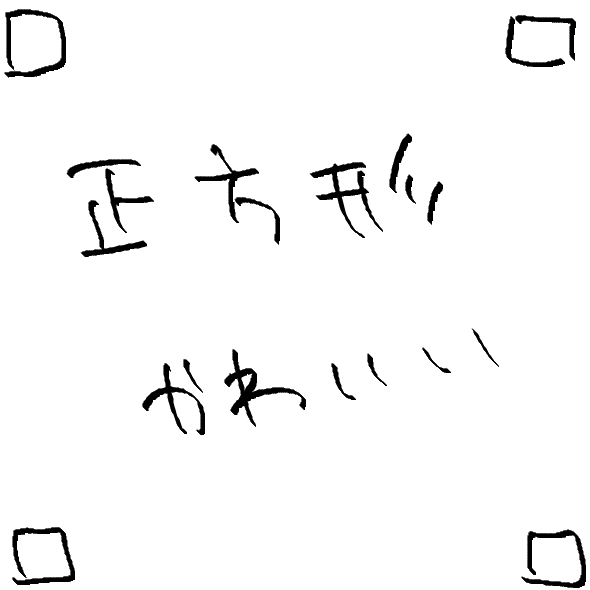
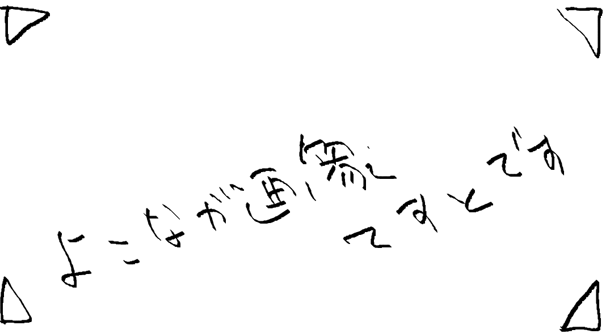
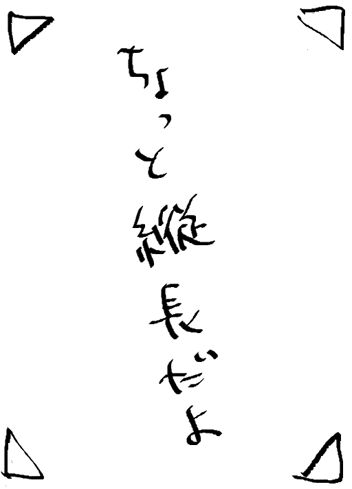

```txt
コードブロックテスト
```

## 10%幅

{ width=10% height=auto}  
{ width=10% height=auto}  
{ width=10% height=auto}  
{ width=10% height=auto}  

***

## 20%幅

{ width=20% height=auto}  
{ width=20% height=auto}  
{ width=20% height=auto}  
{ width=20% height=auto}

***
## 30%幅

{ width=30% height=auto}  
{ width=30% height=auto}  
{ width=30% height=auto}  
{ width=30% height=auto}  

***
## 40%幅

{ width=40% height=auto}  
{ width=40% height=auto}  
{ width=40% height=auto}  
{ width=40% height=auto}  

***
## 50%幅

{ width=50% height=auto}  
{ width=50% height=auto}  
{ width=50% height=auto}  
{ width=50% height=auto}  

***
## 60%幅

{ width=60% height=auto}  
{ width=60% height=auto}  
{ width=60% height=auto}  
{ width=60% height=auto}  
