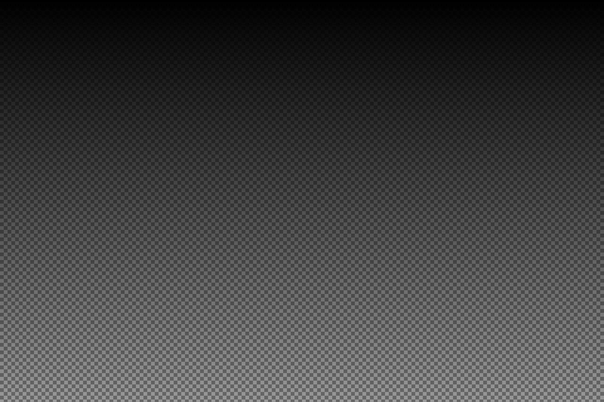
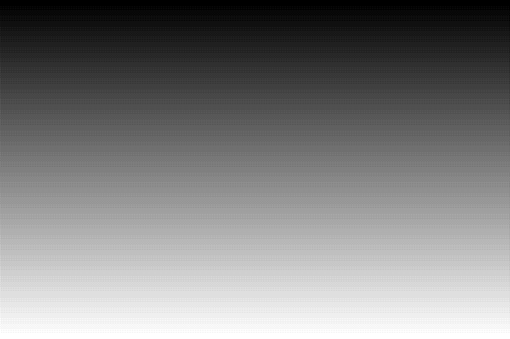
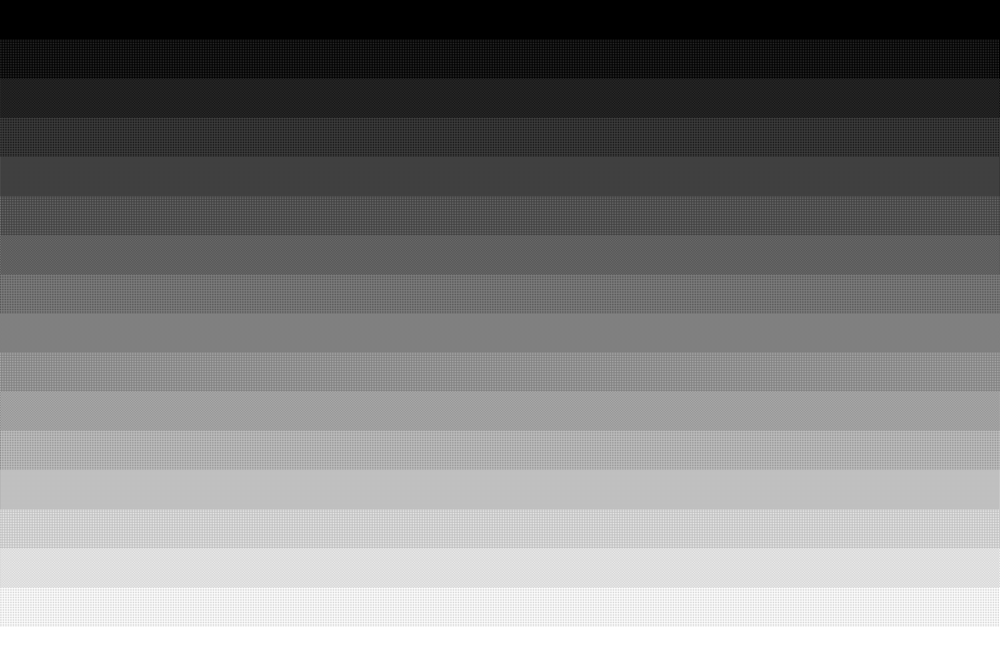
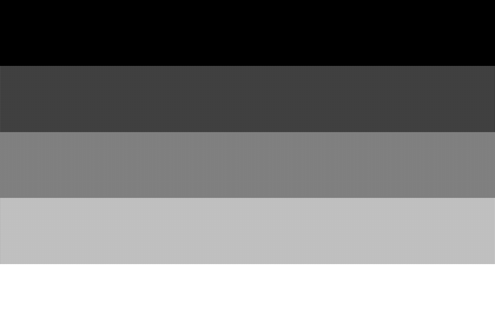

# 特殊文字祭り 


## LUA

```
-- TeXの制御文字 → エスケープ文字
-- TeXの制御文字のマッピング表
local TeX_map = {
  ["\\"] = "\\textbackslash", ["#"] = "\\#", ["%$"] = "\\$", ["%%"] = "\\%%", ["&"] = "\\&",
  ["~"] = "\\textasciitilde", ["%^"] = "\\textasciicircum", ["{"] = "\\{{", ["}"] = "\\}",
}
```

## 通常文中（Para / Plain）

- バックスラッシュ: `\\` → 1つの `\` 
- ハッシュ: \#
- ドル: \$
- パーセント: \%
- アンパサンド: \&
- チルダ: \~
- ハット: \^
- 波括弧(開): \{
- 波括弧(閉): \}

**まとめて一行**： `\\` \# \$ \% \& \~ \^ \{ \}

## URL / パス
- [テキスト: \# \$ \% \& \~ \^ \{ \} \\](https://example.com/sugoi/example)
- https://example.com/sugoi/example
- C:\path\to\file_v1.2\foo%bar.txt

## インラインコード
`a_b_c`, `100%`, `x^2`, `C:\path\foo`, `\{raw\}`

## コードブロック
```text
a_b_c
100%
x^2 + y^2
\LaTeX \textbf{bold}
```


## 矢印・記号
→：`->`, ⇔：`<->`  
≦：`<=`, ≧：`>=`, ±：`+-`

## リスト（Paragraphの一種）
- \# \$ \% \& \~ \^ \{ \} \\
- Windowsパス例: `C:\\Users\\foo\\bar`

## 表（Tableセルは基本テキスト）
| 項目 | 含む文字 |
|---|---|
| 記号列 | \# \$ \% \& \~ \^ \{ \} \\ |

## 連続／境界
- 記号連結1: \#\$\%\&\~\^\{\}\\
- 記号連結2: \\ \# \\ \$ \\ \% \\ \& \\ \~ \\ \^ \\ \{ \\ \}
- 文末＆行頭: 文末\%  
次行先頭\#
次行先頭\$


# 画像パターン テスト

## チェッカー（格子）: 大→小




## ドット半調: 粒度ちがい



